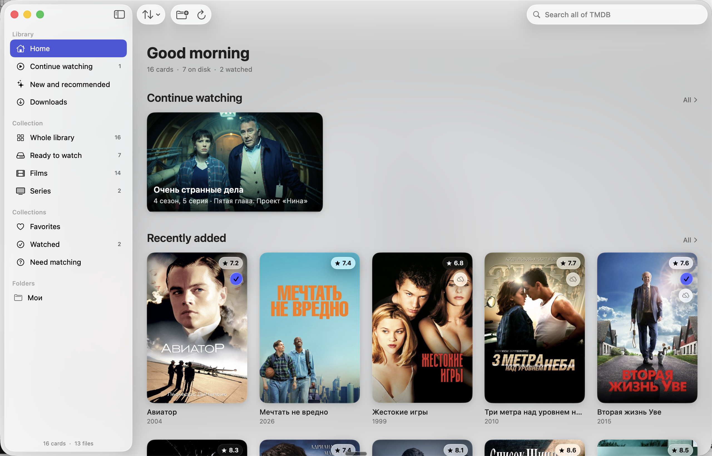
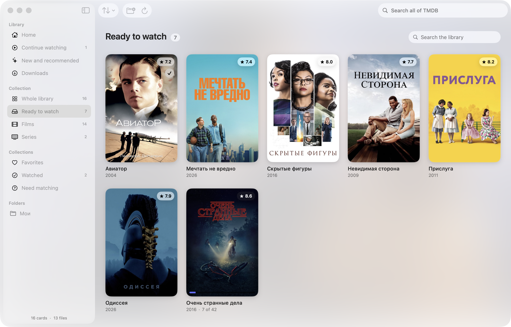
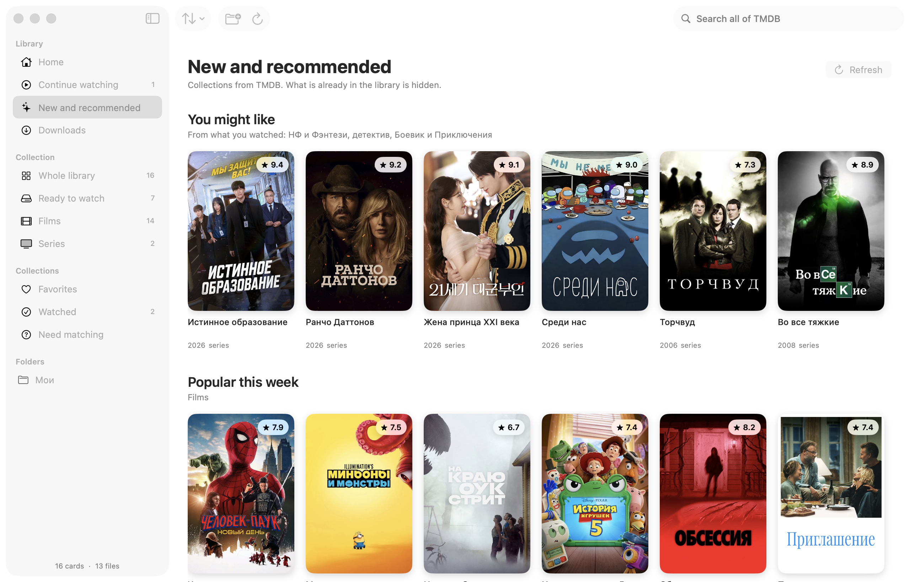
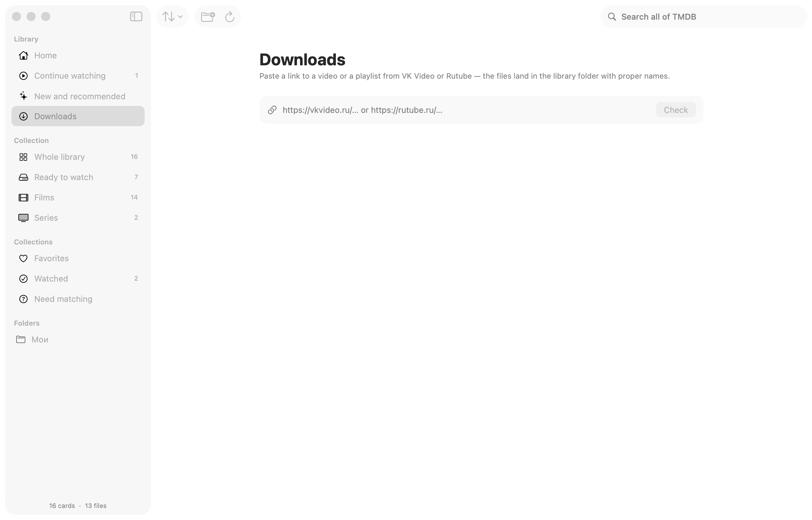

# Lumière

A local video library for macOS 26: SwiftUI with Liquid Glass, metadata from TMDB,
watch tracking that remembers where you stopped. No server — everything stays on your Mac.

[Русская версия](README.ru.md)



## Install

One command, through Homebrew:

```bash
brew install --cask shineexxx/lumiere/lumiere
```

Or grab the disk image from the [latest release](https://github.com/shineexxx/lumiere/releases/latest)
and drag Lumière into Applications.

The app is signed ad-hoc, without a developer account. The cask clears the quarantine flag
for you; if you install from the DMG by hand and macOS says it cannot verify the developer,
right-click the app → Open, or run:

```bash
xattr -dr com.apple.quarantine /Applications/Lumiere.app
```

Requires macOS 26 on Apple Silicon. After that the app updates itself — see [Updates](#updates).

## What it does

- **Library from your own files.** Point it at a folder; nested folders are scanned to any depth.
  File names are parsed for the title, year, season and episode — including messy Russian
  releases like `4 сезон 7 серия` and video-site titles like `Film (movie, 2016)`.
- **Metadata from TMDB.** Posters, descriptions, ratings, cast, episode titles and stills.
  Matches are confirmed by you, or accepted automatically when the app is confident.
- **One playback engine.** Everything goes through VLCKit: MKV, AVI, WMV, MPEG-TS inside `.mp4`
  and whatever else AVFoundation refuses to open.
- **Watch tracking.** Position is remembered per film and per episode, the next episode starts
  by itself, and marks survive deleting the files. Optional iCloud sync, or export to a file.
- **Downloads.** Paste a link to VK Video or Rutube and the file lands in the library folder
  with a proper name; a playlist becomes a whole season laid out as `Series / Season N`.
- **Two searches.** One filters the library section you are in; the one in the top right corner
  searches all of TMDB, so you can open a card for something you do not have yet.
- **Russian and English.** The interface follows the system language; TMDB metadata language
  is a separate setting.

## Screenshots

| Library | New and recommended |
|---|---|
|  |  |

| Downloads |
|---|
|  |

## Updates

The app checks [GitHub Releases](https://github.com/shineexxx/lumiere/releases) on every launch
and compares the latest tag with its own version.

- **“Update automatically”** (Settings → Updates, on by default): a new version downloads by
  itself and waits. It installs only when you press “Restart and update”, so an update never
  interrupts what you are watching.
- With the switch off the app simply tells you a new version is out.
- Manual check: menu Lumière → Check for Updates…

The swap is done by a script that waits for the app to quit, unpacks the new version over the
old one and launches it again. Before installing, the app checks that the archive holds a bundle
with the same identifier.

## Build from source

```bash
Scripts/fetch-vlckit.sh   # VLCKit is ~540 MB and is not stored in the repository
open VideoClient.xcodeproj
```

Build and run with ⌘R, or from the terminal:

```bash
xcodebuild -project VideoClient.xcodeproj -scheme VideoClient -configuration Debug build
```

Signing is ad-hoc (`Sign to Run Locally`) — no developer team needed.

To cut a release (build, install into /Applications, publish the DMG and ZIP, update the cask):

```bash
# raise MARKETING_VERSION in the project first
Scripts/release.sh "what changed"
```

## First run

1. **Settings → TMDB** — paste an API key (free: themoviedb.org → Settings → API).
   Both the short v3 key and the long v4 token work. It is stored in the app settings.
2. **⌘O** — add a folder with films or series.
3. The app scans it, parses the file names and offers TMDB matches for confirmation.

## VLC

Playback is entirely on VLCKit 4 — one engine for every container. AVPlayer stays in the code
as a fallback for builds without the framework.

The framework is not stored in the repository: 543 MB, and single files inside it are over the
GitHub limit. `Scripts/fetch-vlckit.sh` downloads a VLCKit 4.0 build from artifacts.videolan.org
into `Frameworks/VLCKit.xcframework`. Without it the project still builds — all VLC code sits
behind `#if canImport(VLCKit)` — and the app falls back to AVPlayer.

The libVLC log is written to `~/Library/Logs/Lumiere/vlc.log` (warnings and errors); it once
turned out to be what pinned down a crash in the player.

## Downloads

Downloading needs two tools:

```bash
brew install yt-dlp ffmpeg
```

A single link becomes `Title (Year).mp4`; a playlist marked as a series becomes
`Series / Season N / Series - S04E07.mp4`, readable in Finder without the app.

## Sync

Watch marks and positions sync through iCloud (`NSUbiquitousKeyValueStore`) — Settings → Sync.
Only the marks travel; files stay on this Mac. The fresher record wins, and a “watched” mark is
never cleared automatically.

iCloud requires signing the app with your own developer account: with ad-hoc signing no iCloud
container is issued. Export and import through a file work regardless — import merges, it does
not replace.

## Keyboard shortcuts

| Key | Action |
|---|---|
| Space | Pause / continue |
| ← → | Skip 10 seconds |
| ↑ ↓ | Skip one minute |
| N / P | Next / previous episode |
| F | Full screen |
| Esc | Leave full screen or close the player |
| ⌃F | Find (library section or TMDB, depending on where you are) |
| ⇧⌘F | Search all of TMDB |
| ⌘O | Add folder |
| ⌘R | Refresh library |
| ⇧⌘R | Rebuild cards from file names |
| ⌘, | Settings |

## How it works

```
VideoClient/
  App/        entry point, LibraryCoordinator (scanning + metadata)
  Models/     MediaEntry, EpisodeEntry, VideoFileRef, WatchState
  Library/    folder access, scanner, file-name parser, on-device model
  Store/      LibraryStore — @Observable, JSON in Application Support
  TMDB/       client, DTOs, matcher, recommendations, poster cache
  Player/     PlayerEngine protocol, VLC and AVPlayer engines, playback session
  Downloads/  yt-dlp queue and process handling
  Support/    updater, key storage, migrations
  UI/         sidebar, grid, card, match sheet, settings
  Resources/  string catalog (ru + en), icon
```

Data lives in `~/Library/Application Support/Lumiere/library.json`,
posters in `~/Library/Caches/Lumiere/Images`.

Watch rules: position is written once a second, a file counts as watched at **92%** of its
length, and resuming rewinds **8 seconds**. The thresholds are in `WatchRules` (`Models/Models.swift`).

## Limitations

- Files smaller than 50 MB are skipped (`LibraryScanner.minimumFileSize`) so samples and
  trailers stay out of the library.
- External subtitle files (.srt/.ass next to the video) are not picked up; tracks embedded in
  the container are.
- The library is a single JSON file. Fine for a few thousand cards; for tens of thousands
  SwiftData would make more sense.

## License

MIT — see [LICENSE](LICENSE).

VLCKit is LGPL 2.1+ and ships in the built app as a separate dynamically linked framework.
VLC sources are at [videolan.org](https://www.videolan.org/vlc/download-sources.html), VLCKit
builds at [artifacts.videolan.org](https://artifacts.videolan.org/VLCKit/). Metadata and posters
come from [TMDB](https://www.themoviedb.org); this project is not affiliated with or endorsed by TMDB.
